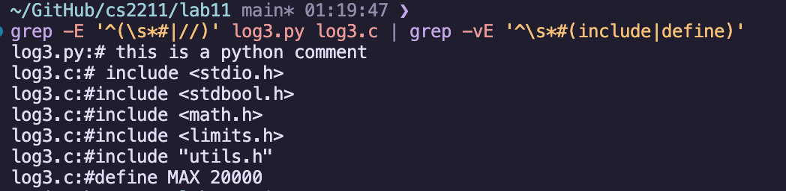
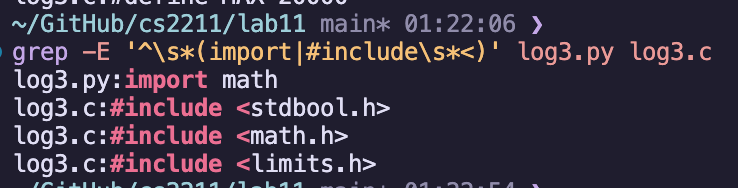
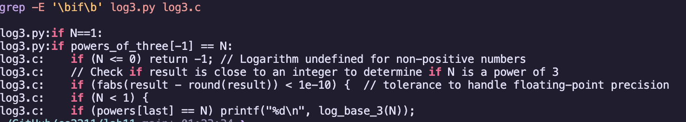
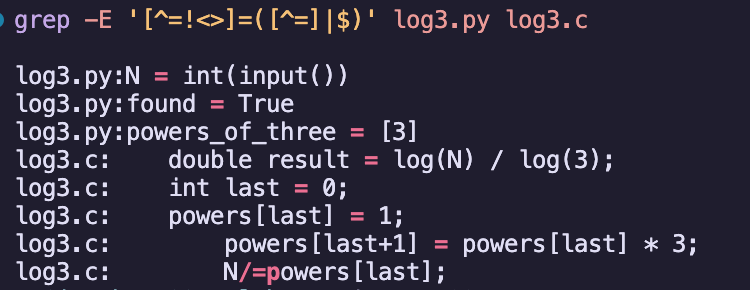
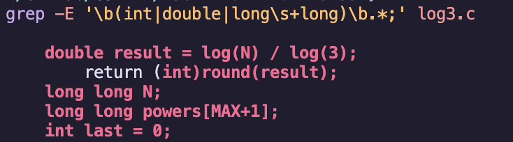

# CS2211 – Lab 11 by Rohin

## 1. Single-line Comments

```
grep -E '^(\s*#|//)' log3.py log3.c | grep -vE '^\s*(#include|#define)'
```



## 2. Imports

```
grep -E '^\s*(import|#include\s*<)' log3.py log3.c
```



## 3. If's

```
grep -E '\bif\b' log3.py log3.c
```



## 4. Assignments, but not Relational

```
grep -E '[^=!<>]=([^=]|$)' log3.py log3.c
```



## 5. Variable Declars

```
grep -E '\b(int|double|long\s+long)\b.*;' log3.c
```


